# 🛡️ AI-Powered Threat Detection & Intelligence System

> **Real-time audio surveillance intelligence for national security agencies**

---

## 📹 Demo Video

[](https://drive.google.com/file/d/15wfODSVjZ6B8_3-etgLTyf-_O86hSpAv/view?usp=sharing)

---

## 📌 Project Overview

This project is an end-to-end AI-driven threat detection system capable of processing intercepted audio communications from multiple sources — including military, police, and civilian channels — to automatically identify, analyze, and connect criminal and terrorist activities in real time.

The system leverages state-of-the-art large language models (Groq Whisper for transcription, Llama 3.3 for analysis) to transcribe multi-language audio, extract intelligence entities, decode coded language, and semantically connect conversations across time — even when different words are used to describe the same threat.

---

## 🎯 Key Features

| Feature | Description |
|---|---|
| 🎤 **Multi-Language Audio** | Transcribes 15+ languages (Hindi, Urdu, English, Pashto, Arabic, Bengali...) with auto-detection and English translation |
| 🧠 **LLM Threat Analysis** | Groq Llama 3.3 70B analyzes every conversation for threat score (0–100), crime type, harm prediction |
| 🔍 **Entity Extraction** | Auto-detects persons, locations, organizations, weapons, vehicles, money, dates/times |
| 🔑 **Code Word Decoding** | Context-aware AI decoding — no hardcoded dictionary. "Diwali gifts" = weapons shipment |
| 🔗 **Connect the Dots** | Semantic cross-conversation linking — finds connections even with completely different words |
| 👤 **Person Alias Detection** | Muhammad = Mohd = Md — LLM handles abbreviations, nicknames, cross-language names |
| 🕸️ **Knowledge Graph** | Neo4j-style interactive graph with drag-to-pin nodes, semantic links, threat taxonomy |
| 🚨 **Auto Alerts** | Automatic alert generation when threat score ≥ 75, with severity levels and recommended actions |
| 📊 **Intelligence Dashboard** | Real-time KPIs, threat distribution charts, top persons, active alerts, API usage |
| 📤 **Export** | Export alerts as JSON or CSV for reporting |

---

## 🖥️ Screenshots

### Dashboard
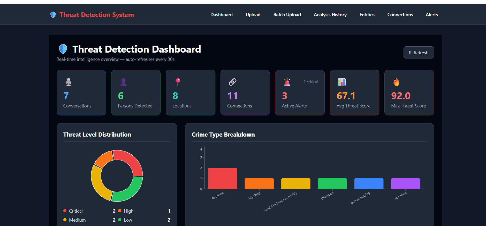

### Upload & Analysis
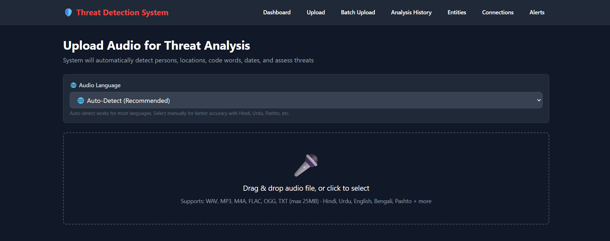

### Full Analysis View
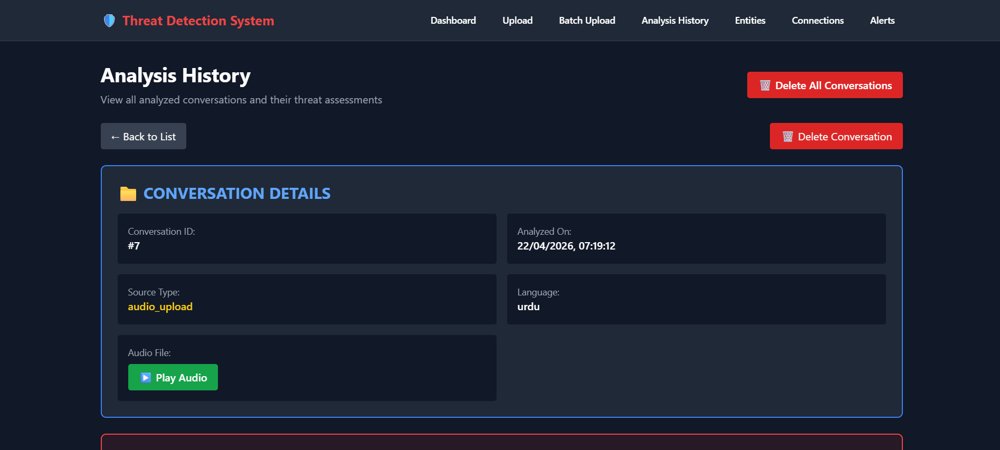
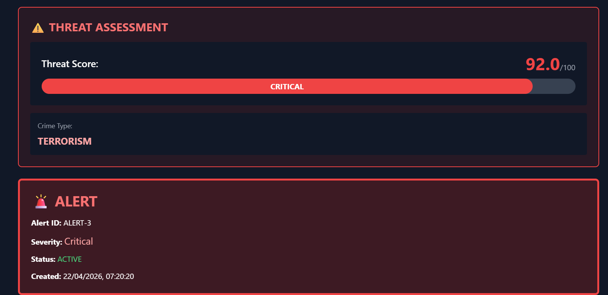
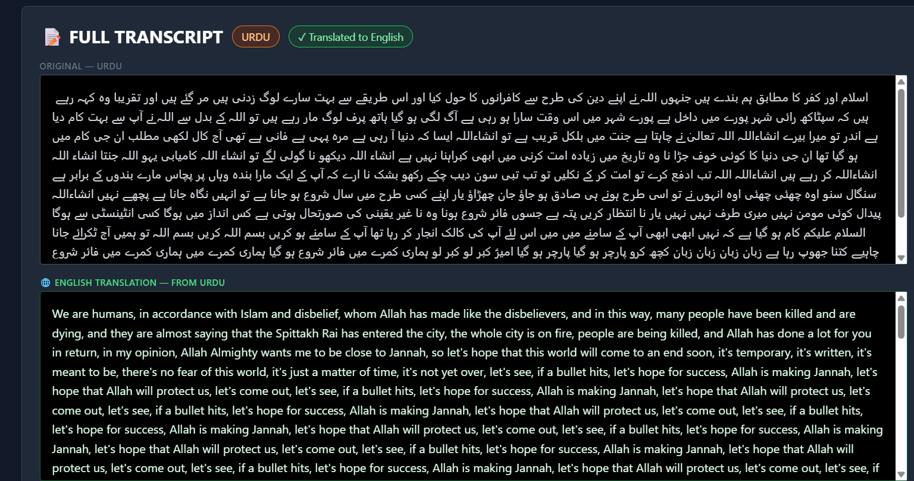
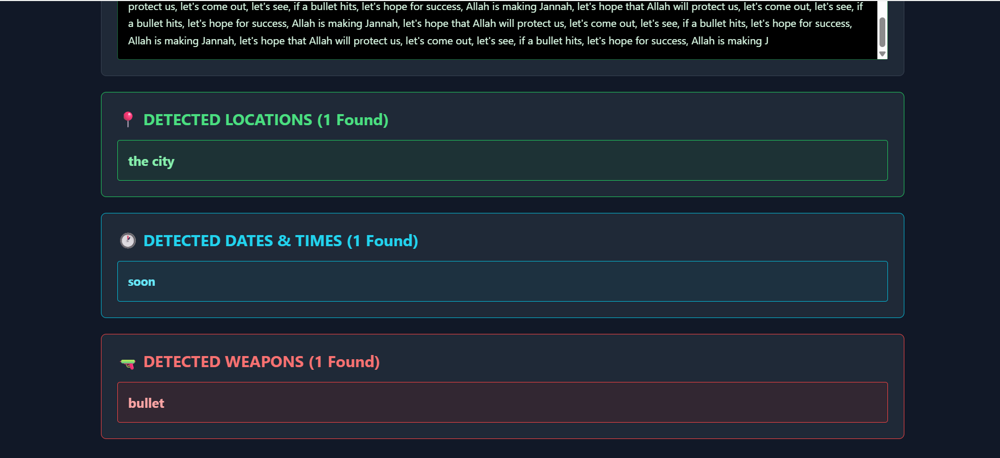

### Alerts
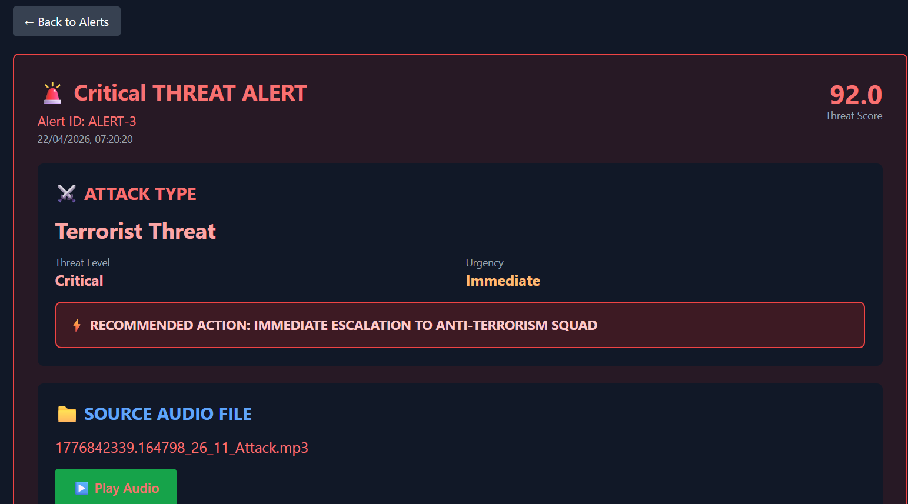
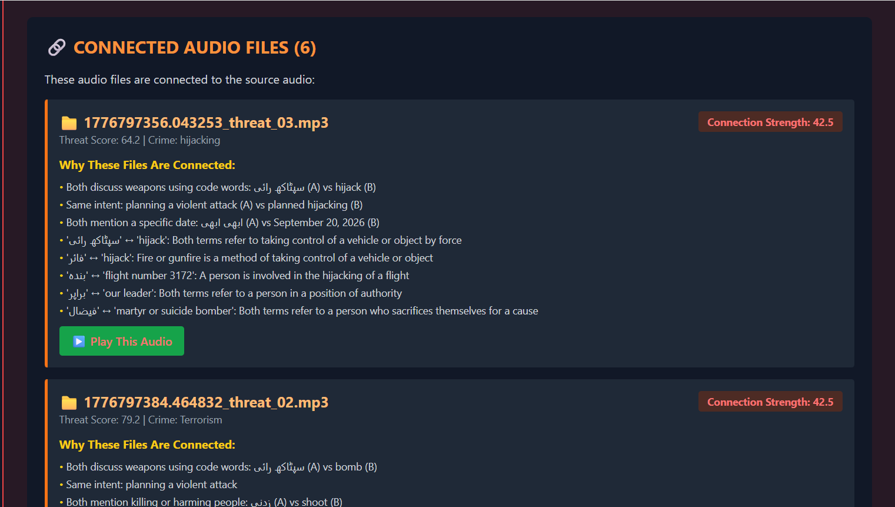
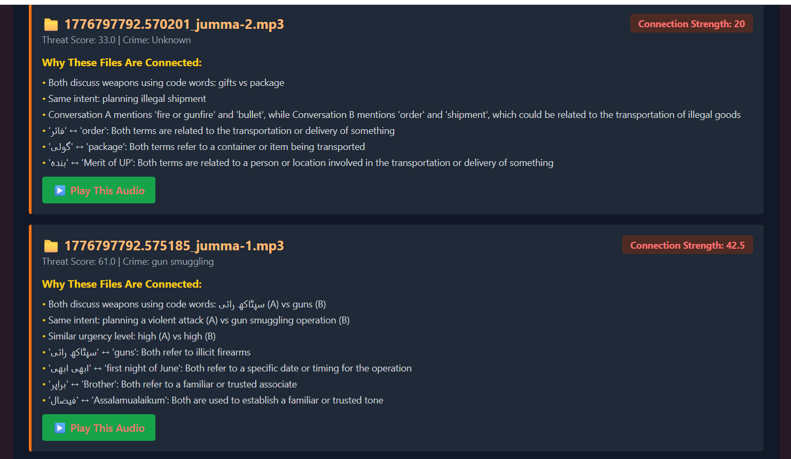
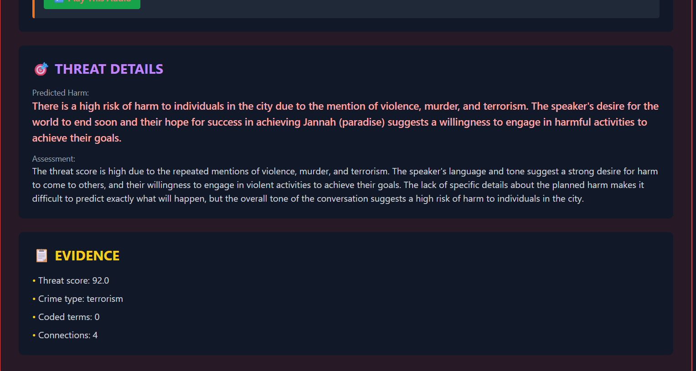

### Conversation History
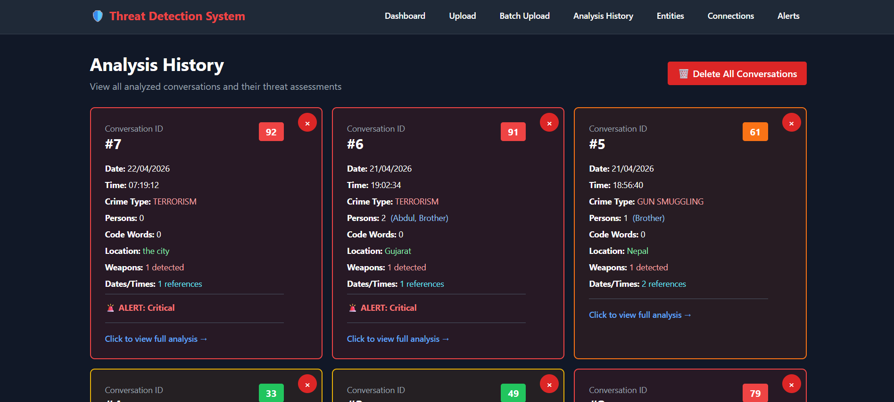

### Entity Explorer
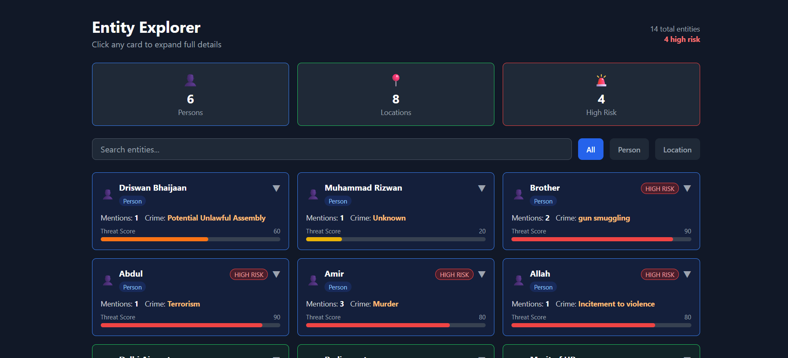

### Knowledge Graph
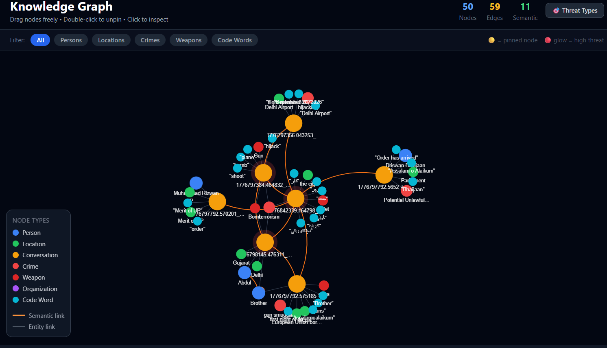

---

## 🏗️ System Architecture

```
┌─────────────────────────────────────────────────────────┐
│                    FRONTEND (React)                      │
│  Dashboard │ Upload │ Analysis │ Entities │ Graph │ Alerts│
└─────────────────────┬───────────────────────────────────┘
                      │ HTTP / REST API
┌─────────────────────▼───────────────────────────────────┐
│                  BACKEND (FastAPI)                       │
│                                                         │
│  ┌──────────┐  ┌──────────┐  ┌─────────────────────┐   │
│  │  Whisper │  │ Llama 3.3│  │ Semantic Connector  │   │
│  │ (Groq)   │  │ (Groq)   │  │ (Connect the Dots)  │   │
│  └──────────┘  └──────────┘  └─────────────────────┘   │
│                                                         │
│  ┌──────────┐  ┌──────────┐  ┌─────────────────────┐   │
│  │  SQLite  │  │ ChromaDB │  │   Rate Limiter      │   │
│  │   (DB)   │  │ (Vector) │  │  (Smart Models)     │   │
│  └──────────┘  └──────────┘  └─────────────────────┘   │
└─────────────────────────────────────────────────────────┘
```

---

## 🔬 How It Works

### 1. Upload Audio
Drop any audio file (WAV, MP3, M4A, FLAC, OGG). Select language or let Whisper auto-detect.

### 2. Transcription + Translation
Groq Whisper transcribes the audio. If non-English, the system auto-translates to English and shows both versions side by side.

### 3. Threat Analysis
Llama 3.3 70B analyzes the English transcript and extracts:
- Threat score (0–100)
- Crime type (terrorism, drugs, weapons, human trafficking, etc.)
- All entities (persons, locations, weapons, vehicles, money, dates)
- Harm prediction and reasoning

### 4. Semantic Feature Extraction
A second LLM pass extracts code words with their likely meanings based on context — no dictionary needed.

### 5. Connect the Dots
Every new conversation is compared against all existing ones using:
- LLM semantic similarity (understands "Diwali gifts" = "festival package" = weapons)
- Person alias detection (Muhammad = Mohd)
- Same locations, weapons, organizations, crime types

### 6. Alert Generation
If threat score ≥ 75, an alert is automatically created with severity level and recommended action.

---

## 🚀 Quick Start

### Prerequisites
- Python 3.10+
- Node.js 18+
- Groq API key (free at [console.groq.com](https://console.groq.com))

### 1. Clone & Setup

```bash
git clone <repo>
cd SARCIS-2
```

### 2. Configure Environment

```env
# .env
GROQ_API_KEY=your_groq_api_key_here
GROQ_WHISPER_MODEL=whisper-large-v3
GROQ_CRITICAL_MODEL=llama-3.3-70b-versatile
GROQ_CHEAP_MODEL=llama-3.1-8b-instant
```

### 3. Start Backend

```bash
cd backend
pip install -r requirements.txt
python main.py
# Runs on http://localhost:8000
```

### 4. Start Frontend

```bash
cd frontend
npm install
npm start
# Runs on http://localhost:3000
```

---

## 📡 API Endpoints

| Method | Endpoint | Description |
|--------|----------|-------------|
| `POST` | `/upload` | Upload & analyze audio file |
| `POST` | `/upload/batch` | Batch upload (up to 1000 files) |
| `GET` | `/conversations` | All analyzed conversations |
| `GET` | `/alerts` | All threat alerts |
| `GET` | `/alerts/export?format=csv` | Export alerts as CSV |
| `GET` | `/alerts/export?format=json` | Export alerts as JSON |
| `GET` | `/entities` | All detected entities |
| `GET` | `/connections` | All discovered connections |
| `GET` | `/dashboard/stats` | System statistics |
| `GET` | `/rate-limit/status` | API usage & model info |

---

## 🌐 Supported Languages

| Language | Code | Language | Code |
|----------|------|----------|------|
| English | `en` | Hindi | `hi` |
| Urdu | `ur` | Arabic | `ar` |
| Bengali | `bn` | Pashto | `ps` |
| Punjabi | `pa` | Tamil | `ta` |
| Telugu | `te` | Marathi | `mr` |
| Gujarati | `gu` | Farsi | `fa` |
| Chinese | `zh` | Russian | `ru` |
| French | `fr` | + more | auto |

---

## 🎯 Threat Types Detected

| Category | Examples |
|----------|---------|
| 💣 Terrorism & Extremism | Bomb making, mass casualty planning, recruitment, radicalization |
| 🔫 Weapons Trafficking | Illegal arms trade, smuggling, explosives, cross-border movement |
| 💊 Drug Operations | Manufacturing, distribution networks, cartel coordination |
| 🔒 Kidnapping & Extortion | Ransom, hostage negotiation, human trafficking |
| 💻 Cybercrime | Ransomware, data breaches, infrastructure hacking |
| 💰 Financial Crime | Money laundering, hawala, crypto fraud, corruption |
| 🕵️ Organized Crime | Gang coordination, contract killing, protection rackets |
| 🏛️ Political Violence | Assassination planning, coup coordination, sabotage |

---

## 🧠 Smart Model Strategy

The system uses different models for different tasks to maximize efficiency:

| Task | Model | Why |
|------|-------|-----|
| Transcription | `whisper-large-v3` | Best accuracy for audio |
| Threat Analysis | `llama-3.3-70b-versatile` | Critical — needs accuracy |
| Semantic Extraction | `llama-3.1-8b-instant` | Fast & cheap |
| Translation | `llama-3.1-8b-instant` | Fast & cheap |
| Comparison | `llama-3.1-8b-instant` | Fast & cheap |

---

## 🗄️ Database Schema

```
conversations     — transcripts, threat scores, language, entities
persons           — names, aliases, threat scores, mention counts
locations         — names, threat levels, event counts
relationships     — person-to-person connections
conversation_connections — semantic links between conversations
alerts            — threat alerts with evidence and severity
```

All data stored locally in SQLite. No data leaves the server except for Groq API calls.

---

## 📦 Tech Stack

**Backend**
- FastAPI + Uvicorn
- SQLite + SQLAlchemy
- ChromaDB (vector search)
- Groq API (Whisper + Llama)
- Sentence Transformers

**Frontend**
- React 18
- Tailwind CSS
- React Force Graph 2D (knowledge graph)
- Recharts (dashboard charts)
- React Query

---

## 👥 Team

Built for **RAW (Research and Analysis Wing)** — India's external intelligence agency — as a production-ready audio surveillance intelligence platform.

---

## 📄 License

This project is developed for defense and intelligence applications. All rights reserved.
